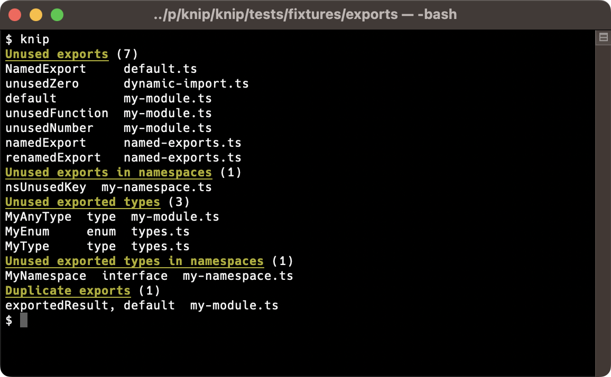
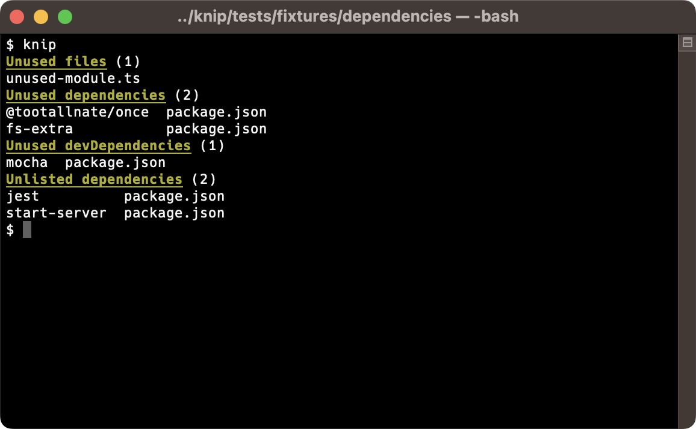
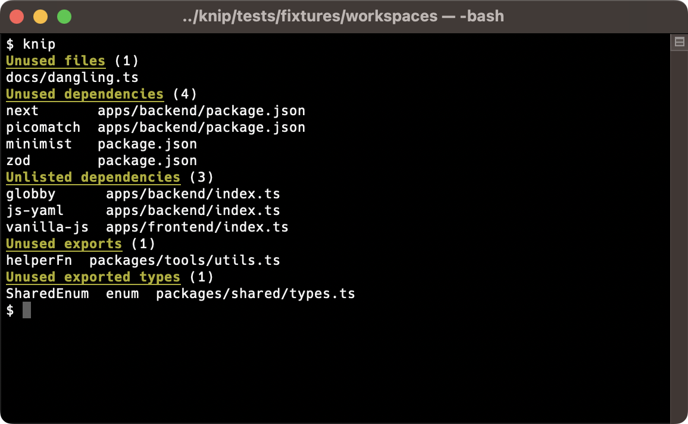

# ✂️ Knip

Knip finds **unused files, dependencies and exports** in your JavaScript and TypeScript projects. Less code and
dependencies lead to improved performance, less maintenance and easier refactorings.

```ts
export const myVar = true;
```

This is where ESLint stops: it handles files in isolation, so it does not know whether `myVar` is used somewhere else.
This is where Knip starts: it lints the project as a whole and finds unused exports, files and dependencies.

It's only human to forget to remove things that you no longer use. But how do you find out? Where do you start finding
things that can be removed?

The dots don't connect themselves. This is where Knip comes in:

- [x] Finds **unused files, dependencies and exports**
- [x] Finds used dependencies not listed in `package.json`
- [x] Built-in support for [workspaces (monorepos)][1]
- [x] Growing list of [built-in plugins][2]
- [x] Use [compilers][3] to include other file types (e.g. `.mdx`, `.vue`, `.svelte`)
- [x] Finds binaries and dependencies in npm scripts, and a lot more locations
- [x] Finds unused members of classes and enums
- [x] Finds duplicate exports
- [x] Supports any combination of JavaScript and TypeScript
- [x] Features multiple [reporters][4] and supports [custom reporters][5]
- [x] Run Knip as part of your CI environment to detect issues and prevent regressions

Knip shines in both small and large projects. It's a fresh take on keeping your projects clean & tidy!

[![An orange cow with scissors, Van Gogh style][7]][6] <sup>_“An orange cow with scissors, Van Gogh style” - generated
with OpenAI_</sup>

## Installation

    npm install -D knip

Knip supports LTS versions of Node.js, and currently requires at least Node.js v16.17 or v18.6.

## Experimental: knowledge base

You might want to ask your questions in the [Knip knowledge base][8] (powered by OpenAI and [7-docs][9]). This is an
experimental knowledge base, answers may be incorrect.

## Configuration

Knip has good defaults and you can run it without any configuration. Here's the default:

```json
{
  "entry": ["index.js", "src/index.js"],
  "project": ["**/*.js"]
}
```

In addition to `index.js`, the following file names and extensions are also considered entry files:

- `index`, `main` and `cli`
- `js`, `mjs`, `cjs`, `jsx`, `ts`, `mts`, `cts` and `tsx`

This means files like `main.cjs` and `src/cli.ts` are automatically added as entry files.

### Entry Files

Knip looks for entry files at those default locations, but also in other places:

- The `main`, `bin` and `exports` fields of `package.json`.
- [Plugins][2] such as for Next.js, Remix, Gatsby or Svelte add entry files.
- The `scripts` in package.json or other scripts may provide entry files.

Knip does this for each [workspace][1] it finds, trying to minimize the configuration to suit your project. In a
perfectly boring world where everything is according to defaults you wouldn't even need a `knip.json` file at all.

Larger projects tend to have more things customized, and therefore probably get more out of Knip with a configuration
file. Let's say you are using `.ts` files exclusively and have all source files only in the `src` directory:

```json
{
  "$schema": "https://unpkg.com/knip@2/schema.json",
  "entry": ["src/index.ts"],
  "project": ["src/**/*.ts"]
}
```

The `entry` files target the starting point(s) to resolve the rest of the imported code. The `project` files should
contain all files to match against the files resolved from the entry files, including potentially unused files.

Places where Knip looks for configuration (ordered by priority):

- `knip.json`
- `knip.jsonc`
- `.knip.json`
- `.knip.jsonc`
- `knip.ts`
- `knip.js`
- `package.json#knip`

So you can use a dynamic `knip.ts` with TypeScript if you prefer:

```ts
import type { KnipConfig } from 'knip';

const config: KnipConfig = {
  entry: ['src/index.ts'],
  project: ['src/**/*.ts'],
};

export default config;
```

Then run the checks with `npx knip`. Or first add this script to `package.json`:

```json
{
  "scripts": {
    "knip": "knip"
  }
}
```

Use `npm run knip` to analyze the project and output unused files, dependencies and exports. Knip works just fine with
`yarn` or `pnpm` as well.

Using workspaces in a monorepo? Please see [workspaces][1] for more details about configuring them.

## Command-line options

    $ npx knip --help
    ✂️  Find unused files, dependencies and exports in your JavaScript and TypeScript projects

    Usage: knip [options]

    Options:
      -c, --config [file]      Configuration file path (default: [.]knip.json[c], knip.js, knip.ts or package.json#knip)
      -t, --tsConfig [file]    TypeScript configuration path (default: tsconfig.json)
      --production             Analyze only production source files (e.g. no tests, devDependencies, exported types)
      --strict                 Consider only direct dependencies of workspace (not devDependencies, not other workspaces)
      --workspace              Analyze a single workspace (default: analyze all configured workspaces)
      --no-gitignore           Don't use .gitignore
      --include                Report only provided issue type(s), can be comma-separated or repeated (1)
      --exclude                Exclude provided issue type(s) from report, can be comma-separated or repeated (1)
      --dependencies           Shortcut for --include dependencies,unlisted,unresolved
      --exports                Shortcut for --include exports,nsExports,classMembers,types,nsTypes,enumMembers,duplicates
      -n, --no-progress        Don't show dynamic progress updates
      --reporter               Select reporter: symbols, compact, codeowners, json (default: symbols)
      --reporter-options       Pass extra options to the reporter (as JSON string, see example)
      --no-config-hints        Suppress configuration hints
      --no-exit-code           Always exit with code zero (0)
      --max-issues             Maximum number of issues before non-zero exit code (default: 0)
      -d, --debug              Show debug output
      --debug-file-filter      Filter for files in debug output (regex as string)
      --performance            Measure count and running time of expensive functions and display stats table
      --h, --help              Print this help text
      --V, version             Print version

    (1) Issue types: files, dependencies, unlisted, unresolved, exports, nsExports, classMembers, types, nsTypes, enumMembers, duplicates

    Examples:

    $ knip
    $ knip --production
    $ knip --workspace packages/client --include files,dependencies
    $ knip -c ./config/knip.json --reporter compact
    $ knip --reporter codeowners --reporter-options '{"path":".github/CODEOWNERS"}'
    $ knip --debug --debug-file-filter '(specific|particular)-module'

    More documentation and bug reports: https://github.com/webpro/knip

## Screenshots

Here's an example run using the default reporter:



This example shows more output related to unused and unlisted dependencies:



## Reading the report

The report contains the following types of issues:

| Key            | Title                               | Description                                           |
| :------------- | :---------------------------------- | :---------------------------------------------------- |
| `files`        | Unused files                        | unable to find references to this file                |
| `dependencies` | Unused dependencies                 | unable to find references to this dependency          |
| `dependencies` | Unused devDependencies              | unable to find references to this dependency          |
| `unlisted`     | Unlisted dependencies               | used dependencies not listed in package.json          |
| `binaries`     | Unlisted binaries                   | binaries from dependencies not in package.json        |
| `unresolved`   | Unresolved imports                  | unable to resolve this (import) specifier             |
| `exports`      | Unused exports                      | unable to find references to this export              |
| `nsExports`    | Unused exports in namespaces        | unable to find direct references to this export _(1)_ |
| `types`        | Unused exported types               | unable to find references to this exported type       |
| `nsTypes`      | Unused exported types in namespaces | unable to find direct references to this export _(1)_ |
| `enumMembers`  | Unused exported enum members        | unable to find references to this enum member         |
| `classMembers` | Unused exported class members       | unable to find references to this class member        |
| `duplicates`   | Duplicate exports                   | the same thing is exported more than once             |

When an issue type has zero issues, it is not shown.

Getting too many reported issues and false positives? Read more about [handling issues][10].

_(1)_ The variable or type is not referenced directly and has become a member of a namespace. Knip can't find a
reference to it, so you can _probably_ remove it.

## Output

### Rules

Use `rules` in the configuration to customize the issue types that count towards the total error count, or to exclude
them altogether.

- `error` (default): printed, adds to total error count (similar to the `--include` filter)
- `warn`: printed in faded/grey color, does not add to error count (i.e. the exit code)
- `off`: not printed, does not add to error count (similar to the `--exclude` filter)

Example:

```json
{
  "rules": {
    "files": "warn",
    "classMembers": "off",
    "duplicates": "off"
  }
}
```

See [reading the report][11] for the list of issue types.

The rules are modeled after the ESLint `rules` configuration, and could be extended in the future. For instance, to
apply filters or configurations only to a specific issue type.

### Filters

You can `--include` or `--exclude` any of the reported issue types to slice & dice the report to your needs.
Alternatively, they can be added to the configuration (e.g. `"exclude": ["dependencies"]`).

Use `--include` to report only specific issue types (the following example commands do the same):

    knip --include files --include dependencies
    knip --include files,dependencies

Use `--exclude` to ignore reports you're not interested in:

    knip --include files --exclude classMembers,enumMembers

Use `--dependencies` or `--exports` as shortcuts to combine groups of related types.

See [reading the report][11] for the list of issue types.

### When to use rules or filters

Filters are meant to be used as command-line flags, rules allow for more fine-grained configuration.

- Rules are more fine-grained since they also have "warn".
- Rules could be extended in the future.
- Filters can be set in configuration and from CLI, rules only in configuration.
- Filters have two groups (`--dependencies` and `--types`), rules don't have any grouping.

## Ignore

There are a few ways to tell Knip to ignore certain packages, binaries, dependencies and workspaces. Some examples:

```json
{
  "ignore": ["**/*.d.ts", "**/fixtures"],
  "ignoreBinaries": ["zip", "docker-compose"],
  "ignoreDependencies": ["hidden-package"],
  "ignoreWorkspaces": ["packages/ignore", "packages/examples/**"]
}
```

These can also be configured per workspace (except for `ignoreWorkspaces`).

## What's next?

This is the fun part! Knip, knip, knip ✂️

As always, make sure to back up files or use Git before deleting files or making changes. Run tests to verify results.

- Unused files can be removed.
- Unused dependencies can be removed from `package.json`.
- Unlisted dependencies should be added to `package.json`.
- Unresolved imports should be reviewed.
- Unused exports and types: remove the `export` keyword in front of unused exports. Then you can see whether the
  variable or type is used within the same file. If this is not the case, it can be removed.
- Duplicate exports can be removed so they're exported only once.

🔁 Repeat the process to reveal new unused files and exports. Sometimes it's so liberating to remove things!

Getting too many reported issues and false positives? Read more about [handling issues][10].

## Workspaces

Workspaces are handled out-of-the-box by Knip. Every workspace is part of the analysis.

Workspaces are sometimes also referred to as package-based monorepos, or as packages in a monorepo. Knip uses the term
workspace exclusively to indicate a directory that has a `package.json`.

Here's an example `knip.json` configuration with some custom `entry` and `project` patterns:

```json
{
  "workspaces": {
    ".": {
      "entry": "scripts/*.js",
      "project": "scripts/**/*.js"
    },
    "packages/*": {
      "entry": "{index,cli}.ts",
      "project": "**/*.ts"
    },
    "packages/my-lib": {
      "entry": "main.js"
    }
  }
}
```

It might be useful to run Knip first with no or little configuration to see where it needs custom `entry` and/or
`project` files. Each workspace has the same [default configuration][12].

The root workspace is named `"."` under `workspaces` (like in the example).

Knip supports workspaces as defined in three possible locations:

- In the `workspaces` array in `package.json` (npm, Yarn, Lerna).
- In the `workspaces.packages` array in `package.json` (legacy).
- In the `packages` array in `pnpm-workspace.yaml` (pnpm).

Extra "workspaces" not configured as a workspace in the root `package.json` can be configured as well, Knip is happy to
analyze unused dependencies and exports from any directory with a `package.json`.

The `ignore`, `ignoreBinaries` and `ignoreDependencies` options are available inside workspace configurations.

Here's some example output when running Knip in a workspace:



Use `--debug` to get more verbose output.

## Plugins

Plugins tell Knip where to look for configuration and entry files, and if necessary have a custom dependency finder.
Knip plugins are automatically activated, you don't need to install or configure anything.

To explain what they do, here's a quick example from a `.eslintrc.json` configuration file (for ESLint):

```json
{
  "extends": ["airbnb"],
  "plugins": ["prettier"]
}
```

Knip's ESLint plugin reads `.eslintrc.json` and will return `eslint-config-airbnb` and `eslint-plugin-prettier` from
this example to Knip, so it can tell you whether `package.json` is out of sync. In a nutshell, this is how plugins work.
This is especially useful over time when such configuration files change (and they will)!

Knip contains a growing list of plugins:

- [Ava][plugin-ava]
- [Babel][plugin-babel]
- [Capacitor][plugin-capacitor]
- [Changesets][plugin-changesets]
- [Commitizen][plugin-commitizen]
- [commitlint][plugin-commitlint]
- [cspell][plugin-cspell]
- [Cypress][plugin-cypress]
- [ESLint][plugin-eslint]
- [Gatsby][plugin-gatsby]
- [GitHub Actions][plugin-github-actions]
- [husky][plugin-husky]
- [Jest][plugin-jest]
- [Lefthook][plugin-lefthook]
- [lint-staged][plugin-lint-staged]
- [markdownlint][plugin-markdownlint]
- [Mocha][plugin-mocha]
- [Next.js][plugin-next]
- [npm-package-json-lint][plugin-npm-package-json-lint]
- [Nx][plugin-nx]
- [nyc][plugin-nyc]
- [Playwright][plugin-playwright]
- [PostCSS][plugin-postcss]
- [Prettier][plugin-prettier]
- [Release It][plugin-release-it]
- [Remark][plugin-remark]
- [Remix][plugin-remix]
- [Rollup][plugin-rollup]
- [Semantic Release][plugin-semantic-release]
- [Sentry][plugin-sentry]
- [Storybook][plugin-storybook]
- [Stryker][plugin-stryker]
- [Svelte][plugin-svelte]
- [Tailwind][plugin-tailwind]
- [TypeDoc][plugin-typedoc]
- [TypeScript][plugin-typescript]
- [Vite][plugin-vite]
- [Vitest][plugin-vitest]
- [Webpack][plugin-webpack]

Plugins are automatically activated. Each plugin is automatically enabled based on simple heuristics. Most of them check
whether one of a few dependencies is listed in `package.json`. Once enabled, they add a set of `config` files for
themselves and/or `entry` files for Knip to analyze.

- `config` files are given to the plugin's dependency finder
- `entry` files are given to Knip to include with the analysis of the rest of the source code

See each plugin's documentation for its default values.

### `config`

Plugins usually include `config` files. They are handled by the plugin's custom dependency finder, which returns all
dependencies referenced in the files it is given. Knip handles the rest to determine which of those dependencies are
unused or missing.

### `entry`

Other configuration files use `require` or `import` statements to use dependencies, so they don't need special handing
and can be analyzed like any other source file. That's why these configuration files are also used as `entry` files.

### Override plugin configuration

Usually, no custom configuration is required for plugins, but if your project uses custom file locations then Knip
allows you to override any defaults. Let's take Cypress for example. By default it uses `cypress.config.js`, but your
project uses `config/cypress.js`. Also, the default pattern for test files is `cypress/e2e/**/*.cy.js`, but your project
has them at `e2e-tests/*.spec.ts`. Here's how to configure this:

```json
{
  "cypress": {
    "entry": ["config/cypress.js", "e2e-tests/*.spec.js"]
  }
}
```

### Multi-project repositories

Some repositories have a single `package.json`, but consist of multiple projects with configuration files across the
repository (such as the [Nx "intregrated repo" style][13]). Let's assume some of these projects are apps and have their
own Cypress configuration and test files. In that case, we could configure the Cypress plugin like this:

```json
{
  "cypress": {
    "entry": ["apps/**/cypress.config.ts", "apps/**/cypress/e2e/*.spec.ts"]
  }
}
```

### Disable a plugin

In case a plugin causes issues, it can be disabled by using `false` as its value (e.g. `"webpack": false`).

### Create a new plugin

Getting false positives because a plugin is missing? Want to help out? Please read more at [writing a plugin][14]. This
guide also contains more details if you want to learn more about plugins and why they are useful.

## Compilers

Knip v2 introduces compilers that allow to include files that are not JavaScript or TypeScript in the process of finding
unused or missing dependencies. For instance, `.mdx`, `.vue` and `.svelte` files come to mind.

Currently, this is only supported by using `knip.js` or `knip.ts`. Provide a `compilers` object in the configuration
where each key represents the extension and the value is a function that takes the contents of these files as input and
returns JavaScript or TypeScript as output. Here is an example that compiles `.mdx` files to JavaScript so these files
and their imports and exports become part of the analysis:

```js
import { compileSync } from 'mdx-js/mdx';

export default {
  compilers: {
    mdx: compileSync,
  },
};
```

Read [Compilers][15] for more details and examples.

## Production Mode

The default mode for Knip is holistic and targets all project code, including configuration files and tests. Test files
usually import production files. This prevents the production files or their exports from being reported as unused,
while sometimes both of them can be removed. This is why Knip has a "production mode".

To tell Knip what is production code, add an exclamation mark behind each `pattern!` that is meant for production and
use the `--production` flag. Here's an example:

```json
{
  "entry": ["src/index.ts!", "build/script.js"],
  "project": ["src/**/*.ts!", "build/*.js"]
}
```

Here's what's included in production mode analysis:

- Only `entry` and `project` patterns suffixed with `!`.
- Only production `entry` file patterns exported by plugins (such as Next.js and Gatsby).
- Only the `start` and `postinstall` scripts (e.g. not the `test` or other npm scripts in `package.json`).
- Only unused `exports`, `nsExports` and `classMembers` are reported (not `types`, `nsTypes`, `enumMembers`).

### Strict

Additionally, the `--strict` flag can be used to:

- Consider `dependencies` (not `devDependencies`) when finding unused or unlisted dependencies.
- Include `peerDependencies` when finding unused or unlisted dependencies.
- Ignore type-only imports (`import type {}`).
- Verify each workspace is self-contained: have their own `dependencies` (and not use packages of ancestor workspaces).

### Plugins

Plugins also have this distinction. For instance, Next.js entry files for pages (`pages/**/*.tsx`) and Remix routes
(`app/routes/**/*.tsx`) are production code, while Jest and Storybook entry files (e.g. `*.spec.ts` or `*.stories.js`)
are not. All of this is handled automatically by Knip and its plugins.

## Paths

Tools like TypeScript, Webpack and Babel support import aliases in various ways. Knip automatically includes
`compilerOptions.paths` from the TypeScript configuration, but does not (yet) automatically find other types of import
aliases. They can be configured manually:

```json
{
  "$schema": "https://unpkg.com/knip@2/schema.json",
  "paths": {
    "@lib": ["./lib/index.ts"],
    "@lib/*": ["./lib/*"]
  }
}
```

Each workspace can also have its own `paths` configured. Note that Knip `paths` follow the TypeScript semantics:

- Path values are an array of relative paths.
- Paths without an `*` are exact matches.

## Reporters

Knip provides the following built-in reporters:

- codeowners
- compact
- json
- symbol

### Custom Reporters

When the provided built-in reporters are not sufficient, a custom reporter can be implemented.

Pass `--reporter ./my-reporter` from the command line. The data can then be used to write issues to `stdout`, a JSON or
CSV file, or sent to a service.

Find more details and ideas in [custom reporters][16].

## Public exports

Sometimes a file that's not an entry file has one or more exports that are public and should not be reported as unused.
Such variables and types can be marked with the JSDoc `@public` tag:

```js
/**
 * Merge two objects.
 *
 * @public
 */

export const merge = function () {};

/** @public */
export const split = function () {};
```

Knip does not report public exports and types as unused.

## Handling Issues

How to handle a long list of reported issues? Seeing too many false positives? Read more about [handling issues][17]
describing potential causes for false positives, and how to handle them.

## Comparison

This table is an ongoing comparison. Based on their docs (please report any mistakes):

| Feature                 | **knip** | [depcheck][18] | [unimported][19] | [ts-unused-exports][20] | [ts-prune][21] |
| :---------------------- | :------: | :------------: | :--------------: | :---------------------: | :------------: |
| Unused files            |    ✅    |       -        |        ✅        |            -            |       -        |
| Unused dependencies     |    ✅    |       ✅       |        ✅        |            -            |       -        |
| Unlisted dependencies   |    ✅    |       ✅       |        ✅        |            -            |       -        |
| [Plugins][2]            |    ✅    |       ✅       |        ❌        |            -            |       -        |
| [Compilers][3]          |    ✅    |       -        |        -         |            -            |       -        |
| Unused exports          |    ✅    |       -        |        -         |           ✅            |       ✅       |
| Unused class members    |    ✅    |       -        |        -         |            -            |       -        |
| Unused enum members     |    ✅    |       -        |        -         |            -            |       -        |
| Duplicate exports       |    ✅    |       -        |        -         |           ❌            |       ❌       |
| Search namespaces       |    ✅    |       -        |        -         |           ✅            |       ❌       |
| Custom reporters        |    ✅    |       -        |        -         |            -            |       -        |
| JavaScript support      |    ✅    |       ✅       |        ✅        |            -            |       -        |
| Configure entry files   |    ✅    |       ❌       |        ✅        |           ❌            |       ❌       |
| [Workspaces][1]         |    ✅    |       ❌       |        ❌        |            -            |       -        |
| ESLint plugin available |    -     |       -        |        -         |           ✅            |       -        |

✅ = Supported, ❌ = Not supported, - = Out of scope

### Migrating from other tools

### depcheck

The following commands are similar:

    depcheck
    knip --dependencies

### unimported

The following commands are similar:

    unimported
    knip --production --dependencies --include files

Also see [production mode][22].

### ts-unused-exports

The following commands are similar:

    ts-unused-exports
    knip --include exports,types,nsExports,nsTypes
    knip --exports  # Adds unused enum and class members

### ts-prune

The following commands are similar:

    ts-prune
    knip --include exports,types
    knip --exports  # Adds unused exports/types in namespaces and unused enum/class members

## Projects using Knip

Many thanks to some of the early adopters of Knip:

- [Abracabra][23]
- [Block Protocol][24]
- [Cursor][25]
- [DeepmergeTS][26]
- [eslint-plugin-functional][27]
- [freeCodeCamp.org][28]
- [is-immutable-type][29]
- [release-it][30]
- [Template TypeScript Node Package][31]

## Potential boost with `--no-gitignore`

Running Knip on large workspaces with many packages may feel a bit sluggish. Knip looks up `.gitignore` files and uses
them to filter out matching entry and project files. This increases correctness. However, you might want to disable that
with `--no-gitignore` and enjoy a significant performance boost. Depending on the contents of the `.gitignore` files,
the reported issues may be the same. To help determine whether this trade-off might be worth it for you, first check the
difference in unused files:

```shell
diff <(knip --no-gitignore --include files) <(knip --include files)
```

And to measure the difference of this flag in seconds:

```shell
SECONDS=0; knip > /dev/null; t1=$SECONDS; SECONDS=0; knip --no-gitignore > /dev/null; t2=$SECONDS; echo "Difference: $((t1 - t2)) seconds"
```

⏲️ Analysis on a large project went from 33 down to 9 seconds (that's >70% faster).

## Knip

Knip is Dutch for a "cut". A Dutch expression is "to be ge**knip**t for something", which means to be perfectly suited
for the job. I'm motivated to make Knip perfectly suited for the job of cutting projects to perfection! ✂️

## Really, another unused file/dependency/export finder?

As listed above, there are already some great packages available if you want to find unused dependencies OR unused
exports. I love the Unix philosophy ("do one thing well"). But looking at what Knip does, I believe it's efficient to
handle multiple concerns in a single tool. When building a dependency graph of the project, an abstract syntax tree for
each file, and traversing all of this, why not collect the various issues in one go?

## Contributors

Special thanks to the wonderful people who have contributed to this project:

[![Contributors][33]][32]

[1]: #workspaces
[2]: #plugins
[3]: #compilers
[4]: #reporters
[5]: #custom-reporters
[6]: https://labs.openai.com/s/xZQACaLepaKya0PRUPtIN5dC
[7]: ./assets/cow-with-orange-scissors-van-gogh-style.webp
[8]: https://knip.deno.dev
[9]: https://github.com/7-docs/7-docs
[10]: #handling-issues
[11]: #reading-the-report
[12]: #configuration
[13]: https://nx.dev/concepts/integrated-vs-package-based
[14]: ./docs/writing-a-plugin.md
[15]: ./docs/compilers.md
[16]: ./docs/custom-reporters.md
[17]: ./docs/handling-issues.md
[18]: https://github.com/depcheck/depcheck
[19]: https://github.com/smeijer/unimported
[20]: https://github.com/pzavolinsky/ts-unused-exports
[21]: https://github.com/nadeesha/ts-prune
[22]: #production-mode
[23]: https://github.com/nicoespeon/abracadabra
[24]: https://github.com/blockprotocol/blockprotocol
[25]: https://github.com/getcursor/cursor
[26]: https://github.com/RebeccaStevens/deepmerge-ts
[27]: https://github.com/eslint-functional/eslint-plugin-functional
[28]: https://github.com/freeCodeCamp/freeCodeCamp
[29]: https://github.com/RebeccaStevens/is-immutable-type
[30]: https://github.com/release-it/release-it
[31]: https://github.com/JoshuaKGoldberg/template-typescript-node-package
[32]: https://github.com/webpro/knip/graphs/contributors
[33]: https://contrib.rocks/image?repo=webpro/knip
[plugin-ava]: ./src/plugins/ava
[plugin-babel]: ./src/plugins/babel
[plugin-capacitor]: ./src/plugins/capacitor
[plugin-changesets]: ./src/plugins/changesets
[plugin-commitizen]: ./src/plugins/commitizen
[plugin-commitlint]: ./src/plugins/commitlint
[plugin-cspell]: ./src/plugins/cspell
[plugin-cypress]: ./src/plugins/cypress
[plugin-eslint]: ./src/plugins/eslint
[plugin-gatsby]: ./src/plugins/gatsby
[plugin-github-actions]: ./src/plugins/github-actions
[plugin-husky]: ./src/plugins/husky
[plugin-jest]: ./src/plugins/jest
[plugin-lefthook]: ./src/plugins/lefthook
[plugin-lint-staged]: ./src/plugins/lint-staged
[plugin-markdownlint]: ./src/plugins/markdownlint
[plugin-mocha]: ./src/plugins/mocha
[plugin-next]: ./src/plugins/next
[plugin-npm-package-json-lint]: ./src/plugins/npm-package-json-lint
[plugin-nx]: ./src/plugins/nx
[plugin-nyc]: ./src/plugins/nyc
[plugin-playwright]: ./src/plugins/playwright
[plugin-postcss]: ./src/plugins/postcss
[plugin-prettier]: ./src/plugins/prettier
[plugin-release-it]: ./src/plugins/release-it
[plugin-remark]: ./src/plugins/remark
[plugin-remix]: ./src/plugins/remix
[plugin-rollup]: ./src/plugins/rollup
[plugin-semantic-release]: ./src/plugins/semantic-release
[plugin-sentry]: ./src/plugins/sentry
[plugin-storybook]: ./src/plugins/storybook
[plugin-stryker]: ./src/plugins/stryker
[plugin-svelte]: ./src/plugins/svelte
[plugin-tailwind]: ./src/plugins/tailwind
[plugin-typedoc]: ./src/plugins/typedoc
[plugin-typescript]: ./src/plugins/typescript
[plugin-vite]: ./src/plugins/vite
[plugin-vitest]: ./src/plugins/vitest
[plugin-webpack]: ./src/plugins/webpack
