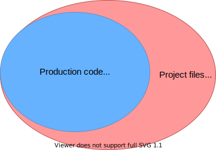

# Exportman 🦸

Exportman scans your TypeScript projects for **unused files and exports**. For comparison, ESLint finds unused variables
inside files in isolation, but this will not be flagged:

```ts
export const myVar = true;
```

Unused files will also not be detected by ESLint. So how do you know which files and exports are no longer used? This
requires an analysis of all the right files in the project.

This is where Exportman comes in:

- [x] Resolves all (unused) files in your project and reports **unused files and exports**.
- [x] Verifies that exported symbols are actually used in other files, even when part of an imported namespace.
- [x] Finds duplicate exports of the same symbol.
- [x] Supports JavaScript inside TypeScript projects (`"allowJs": true`)
- [ ] Supports JavaScript-only projects with CommonJS and ESM (no `tsconfig.json`) - TODO

Exportman really shines in larger projects where you have much more files (such as `/docs`, `/tools` and `/scripts`)
than only production code. The `includes` setting in `tsconfig.json` is often too broad, resulting in too many false
negatives. Similar projects either detect only unimported files, or only unused exports. Most of them don't work by
configuring entry files, an essential feature to produce good results. This also allows to unleash Exportman on a
specific part of your project, and work these separately.

Exportman is another fresh take on keeping your projects clean & tidy.

## Installation

```
npm install -D exportman
```

## Usage

Create a configuration file, let's name it `.exportman.json` with these contents:

```json
{
  "entryFiles": ["src/index.ts"],
  "filePatterns": ["src/**/*.ts", "!**/*.spec.ts"]
}
```

The `entryFiles` target the starting point(s) to resolve production code dependencies. The `filePatterns` should contain
all files it should match them against, including potentially unused files.

Then run the checks:

```
npx exportman --config .exportman
```

This will analyze the project and output unused files, exports, types and duplicate exports.

Use `--onlyFiles` when configuring Exportman for faster initial results.

## How It Works

Exportman works by creating two sets of files:

1. Production code is the set of files resolved from the `entryFiles`.
2. Project files are the full set of files matching the `filePatterns`.
3. The subset of project files that are not production code will be reported as unused files (in red).
4. Then the production code (in blue) will be scanned for unused exports.



Clean and actionable reports are achieved when non-production code such as tests are excluded from the `filePatterns`
(using negation patterns such as `!**/*.test.ts`).

## Options

```
❯ npx exportman
exportman --config ./config.js[on] [options]

Options:
  --config [file]               Path of configuration file (JS or JSON),
                                requires `entryFiles: []` and `filePatterns: []`
  --cwd                         Working directory (default: current working directory)
  --only                        Report only listed issue group(s): files, exports, types, members, duplicates
  --exclude                     Exclude issue group(s) from report: files, exports, types, members, duplicates
  --noProgress                  Don't show dynamic progress updates
  --reporter                    Select reporter: symbols, compact (default: symbols)
  --jsdoc                       Enable JSDoc parsing, with options: public (default: disabled)

Examples:

$ exportman --config ./exportman.json
$ exportman --config ./exportman.json --cwd packages/client --reporter compact --jsdoc public
$ exportman --config ./exportman.js --only files,duplicates

More info: https://github.com/webpro/exportman
```

## More configuration examples

### Test files

For best results, it is recommended to exclude files such as tests from the project files. When including tests and
other non-production files, they may prevent production files from being reported as unused. Not including them will
make it clear what production files can be removed (including dependent files!).

The same goes for any type of non-production files, such as Storybook stories or end-to-end tests.

To report dangling files and exports that are not used by any of the production or test files, include both to the set
of `entryFiles`:

```json
{
  "entryFiles": ["src/index.ts", "src/**/*.spec.ts"],
  "filePatterns": ["src/**/*.ts", "!**/*.e2e.ts"]
}
```

In theory this idea could be extended to report some kind of test coverage.

### Monorepos

#### Separate packages

In repos with multiple packages, the `--cwd` option comes in handy. With similar package structures, the packages can be
configured using globs:

```json
{
  "packages/*": {
    "entryFiles": ["src/index.ts"],
    "filePatterns": ["src/**/*.{ts,tsx}", "!**/*.spec.{ts,tsx}"]
  }
}
```

Packages can also be explicitly configured per package directory.

To scan the packages separately, using the first match from the configuration file:

```
exportman --cwd packages/client --config exportman.json
exportman --cwd packages/services --config exportman.json
```

#### Connected projects

A good example of a large project setup is a monorepo, such as created with Nx. Let's take an example project
configuration for an Nx project using Next.js, Jest and Storybook. This can also be a JavaScript file, which allows to
add logic and/or comments:

```js
const entryFiles = ['apps/**/pages/**/*.{js,ts,tsx}'];

const filePatterns = [
  '{apps,libs}/**/*.{ts,tsx}',
  // Next.js
  '!**/next.config.js',
  '!**/apps/**/public/**',
  '!**/apps/**/next-env.d.ts'
  // Jest
  '!**/jest.config.ts',
  '!**/*.spec.{ts,tsx}',
  // Storybook
  '!**/.storybook/**',
  '!**/*.stories.tsx',
];

module.exports = { entryFiles, filePatterns };
```

This should give good results about unused files and exports for the monorepo. After the first run, the configuration
can be tweaked further to the project structure.

## Example Output

### Default reporter

```
$ exportman --config ./exportman.json
--- UNUSED FILES (2)
src/chat/helpers.ts
src/components/SideBar.tsx
--- UNUSED EXPORTS (5)
lowercaseFirstLetter  src/common/src/string/index.ts
RegistrationBox       src/components/Registration.tsx
clamp                 src/css.ts
restoreSession        src/services/authentication.ts
PREFIX                src/services/authentication.ts
--- UNUSED TYPES (4)
enum RegistrationServices  src/components/Registration/registrationMachine.ts
type RegistrationAction    src/components/Registration/registrationMachine.ts
type ComponentProps        src/components/Registration.tsx
interface ProductDetail    src/types/Product.ts
--- DUPLICATE EXPORTS (2)
Registration, default  src/components/Registration.tsx
ProductsList, default  src/components/Products.tsx
```

### Compact

```
$ exportman --config ./exportman.json --reporter compact
--- UNUSED FILES (2)
src/chat/helpers.ts
src/components/SideBar.tsx
--- UNUSED EXPORTS (4)
src/common/src/string/index.ts: lowercaseFirstLetter
src/components/Registration.tsx: RegistrationBox
src/css.ts: clamp
src/services/authentication.ts: restoreSession, PREFIX
--- UNUSED TYPES (3)
src/components/Registration/registrationMachine.ts: RegistrationServices, RegistrationAction
src/components/Registration.tsx: ComponentProps
src/types/Product.ts: ProductDetail
--- DUPLICATE EXPORTS (2)
src/components/Registration.tsx: Registration, default
src/components/Products.tsx: ProductsList, default
```

## Why Yet Another unused file/export finder?

There are some fine modules available in the same category:

- [unimported](https://github.com/smeijer/unimported)
- [ts-unused-exports](https://github.com/pzavolinsky/ts-unused-exports)
- [no-unused-export](https://github.com/plantain-00/no-unused-export)
- [ts-prune](https://github.com/nadeesha/ts-prune)
- [find-unused-exports](https://github.com/jaydenseric/find-unused-exports)

However, the results where not always accurate, and none of them tick my boxes to find both unused files and exports. Or
let me configure entry files and scope the project files for clean results. Especially for larger projects this kind of
configuration is necessary. That's why I took another stab at it.
