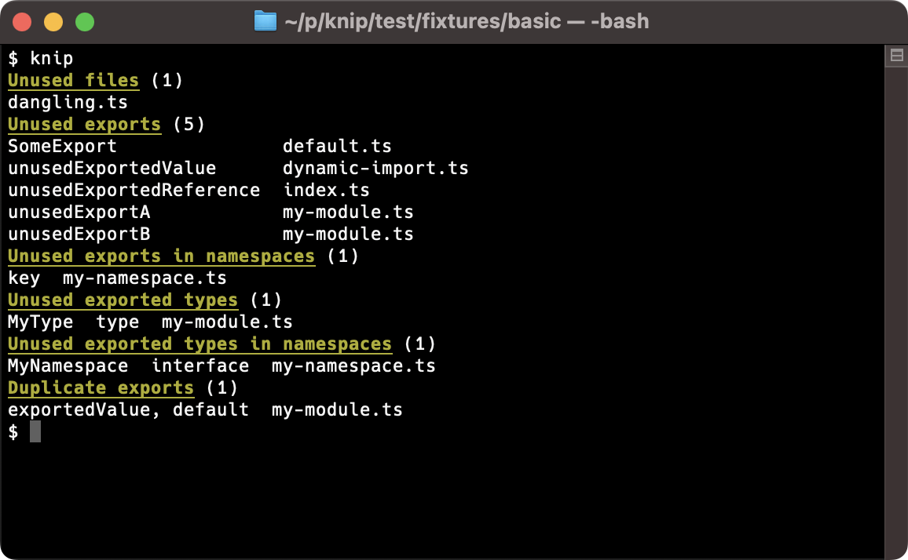
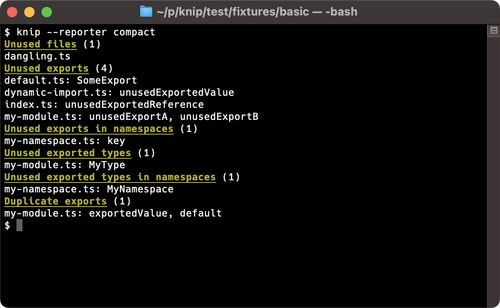

# ✂️ Knip

Knip finds **unused files, dependencies and exports** in your JavaScript and TypeScript projects. Less code and
dependencies leads to improved performance, less maintenance and easier refactorings.

```ts
export const myVar = true;
```

ESLint handles files in isolation, so it does not know whether `myVar` is actually used somewhere else. Knip lints the
project as a whole, and finds unused exports, files and dependencies.

It's only human to forget removing things that you no longer use. But how do you find out? Where to even start finding
things that can be removed?

The dots don't connect themselves. This is where Knip comes in:

- [x] Finds **unused files, dependencies and exports**
- [x] Finds used dependencies not listed in `package.json`
- [x] Finds duplicate exports
- [x] Finds unused members of classes and enums
- [x] Built-in support for [monorepos/workspaces][1]
- [x] Growing list of [built-in plugins][2]
- [x] Checks npm scripts for used and unlisted dependencies
- [x] Supports JavaScript (without `tsconfig.json`, or TypeScript `allowJs: true`)
- [x] Features multiple [reporters][3] and supports [custom reporters][4]
- [x] Run Knip as part of your CI environment to detect issues and prevent regressions

Knip shines in both small and large projects. It's a fresh take on keeping your projects clean & tidy!

[![An orange cow with scissors, Van Gogh style][6]][5] <sup>_“An orange cow with scissors, Van Gogh style” - generated
with OpenAI_</sup>

## Migrating to v1.0.0

When coming from version v0.13.3 or before, please see [migration to v1][7].

## Announcement: Knip v2

The next major release is upcoming. Please see [https://github.com/webpro/knip/issues/73][8] for the full story. Use
`npm install knip@next` to try it out if you're curious! No changes in configuration necessary. Find the updated
documentation at [https://github.com/webpro/knip/blob/v2/README.md][9].

## Issues

Are you seeing false positives? Please report them by [opening an issue in this repo][10]. Bonus points for linking to a
public repository using Knip, or even opening a pull request with a directory and example files in `test/fixtures`.
Correctness and bug fixes have priority over performance and new features.

Also see the [FAQ][11].

## Installation

    npm install -D knip

Knip supports LTS versions of Node.js, and currently requires at least Node.js v16.17 or v18.6. Knip is _cutting edge!_

## Usage

Knip has good defaults and you can run it without any configuration, but especially larger projects get more out of Knip
with a configuration file (or a `knip` property in `package.json`). Let's name this file `knip.json` with these contents
(you might want to adjust right away for your project):

```json
{
  "$schema": "https://unpkg.com/knip@1/schema.json",
  "entry": ["src/index.ts"],
  "project": ["src/**/*.ts"]
}
```

The `entry` files target the starting point(s) to resolve the rest of the imported code. The `project` files should
contain all files to match against the files resolved from the entry files, including potentially unused files.

Use `knip.ts` with TypeScript if you prefer:

```ts
import type { KnipConfig } from 'knip';

const config: KnipConfig = {
  entry: ['src/index.ts'],
  project: ['src/**/*.ts'],
};

export default config;
```

If you have, please see [workspaces & monorepos][1].

Then run the checks with `npx knip`. Or first add this script to `package.json`:

```json
{
  "scripts": {
    "knip": "knip"
  }
}
```

Use `npm run knip` to analyze the project and output unused files, dependencies and exports. Knip works just fine with
`yarn` or `pnpm` as well.

## Command-line options

    $ npx knip --help
    ✂️  Find unused files, dependencies and exports in your JavaScript and TypeScript projects

    Usage: knip [options]

    Options:
      -c, --config [file]      Configuration file path (default: [.]knip.json[c], knip.js, knip.ts or package.json#knip)
      -t, --tsConfig [file]    TypeScript configuration path (default: tsconfig.json)
      --production             Analyze only production source files (e.g. no tests, devDependencies, exported types)
      --strict                 Consider only direct dependencies of workspace (not devDependencies, not other workspaces)
      --workspace              Analyze a single workspace (default: analyze all configured workspaces)
      --include-entry-exports  Include unused exports in entry files (without `@public`)
      --ignore                 Ignore files matching this glob pattern, can be repeated
      --no-gitignore           Don't use .gitignore
      --include                Report only provided issue type(s), can be comma-separated or repeated (1)
      --exclude                Exclude provided issue type(s) from report, can be comma-separated or repeated (1)
      --dependencies           Shortcut for --include dependencies,unlisted
      --exports                Shortcut for --include exports,nsExports,classMembers,types,nsTypes,enumMembers,duplicates
      --no-progress            Don't show dynamic progress updates
      --reporter               Select reporter: symbols, compact, codeowners, json (default: symbols)
      --reporter-options       Pass extra options to the reporter (as JSON string, see example)
      --no-exit-code           Always exit with code zero (0)
      --max-issues             Maximum number of issues before non-zero exit code (default: 0)
      --debug                  Show debug output
      --debug-file-filter      Filter for files in debug output (regex as string)
      --performance            Measure running time of expensive functions and display stats table
      --h, --help              Print this help text
      --V, version             Print version

    (1) Issue types: files, dependencies, unlisted, exports, nsExports, classMembers, types, nsTypes, enumMembers, duplicates

    Examples:

    $ knip
    $ knip --production
    $ knip --workspace packages/client --include files,dependencies
    $ knip -c ./config/knip.json --reporter compact
    $ knip --reporter codeowners --reporter-options '{"path":".github/CODEOWNERS"}'
    $ knip --debug --debug-file-filter '(specific|particular)-module'

    More documentation and bug reports: https://github.com/webpro/knip

## Screenshots

Here's an example run using the default reporter:



This example shows more output related to unused and unlisted dependencies:


## Reading the report

The report contains the following types of issues:

- **Unused files**: did not find references to this file
- **Unused dependencies**: did not find references to this dependency
- **Unlisted or unresolved dependencies**: used dependencies, but not listed in package.json _(1)_
- **Unused exports**: did not find references to this exported variable
- **Unused exports in namespaces**: did not find direct references to this exported variable _(2)_
- **Unused exported types**: did not find references to this exported type
- **Unused exported types in namespaces**: did not find direct references to this exported variable _(2)_
- **Unused exported enum members**: did not find references to this member of the exported enum
- **Unused exported class members**: did not find references to this member of the exported class
- **Duplicate exports**: the same thing is exported more than once

When an issue type has zero issues, it is not shown.

_(1)_ This includes imports that could not be resolved.

_(2)_ The variable or type is not referenced directly, and has become a member of a namespace. Knip can't find a
reference to it, so you can _probably_ remove it.

### Output filters

You can `--include` or `--exclude` any of the types to slice & dice the report to your needs. Alternatively, they can be
added to the configuration (e.g. `"exclude": ["dependencies"]`).

Knip finds issues of type `files`, `dependencies`, `unlisted` and `duplicates` very fast. Finding unused exports
requires deeper analysis (`exports`, `nsExports`, `classMembers`, `types`, `nsTypes`, `enumMembers`).

Use `--include` to report only specific issue types (the following example commands do the same):

    knip --include files --include dependencies
    knip --include files,dependencies

Use `--exclude` to ignore reports you're not interested in:

    knip --include files --exclude classMembers,enumMembers

Use `--dependencies` or `--exports` as shortcuts to combine groups of related types.

Still not happy with the results? Getting too much output/false positives? The [FAQ][9] may be useful. Feel free to open
an issue and I'm happy to look into it. Also see the next section on how to [ignore][12] certain false positives:

## Ignore

There are a few ways to tell Knip to ignore certain packages, binaries, dependencies and workspaces. Some examples:

```json
{
  "ignore": ["**/*.d.ts", "**/fixtures"],
  "ignoreBinaries": ["zip", "docker-compose"],
  "ignoreDependencies": ["hidden-package"],
  "ignoreWorkspaces": ["packages/deno-lib"]
}
```

## Now what?

This is the fun part! Knip, knip, knip ✂️

As always, make sure to backup files or use Git before deleting files or making changes. Run tests to verify results.

- Unused files can be removed.
- Unused dependencies can be removed from `package.json`.
- Unlisted dependencies should be added to `package.json`.
- Unused exports and types: remove the `export` keyword in front of unused exports. Then you can see whether the
  variable or type is used within the same file. If this is not the case, it can be removed.
- Duplicate exports can be removed so they're exported only once.

🔁 Repeat the process to reveal new unused files and exports. Sometimes it's so liberating to remove things!

## Workspaces & Monorepos

Workspaces and monorepos are handled out-of-the-box by Knip. Every workspace that is part of the Knip configuration will
be part of the analysis. Here's an example:

```jsonc
{
  "ignoreWorkspaces": ["packages/ignore-me"],
  "workspaces": {
    ".": {
      "entry": "src/index.ts",
      "project": "src/**/*.ts"
    },
    "packages/*": {
      "entry": "{index,cli}.ts",
      "project": "**/*.ts"
    },
    "packages/my-lib": {
      "entry": "main.js"
    }
  }
}
```

Note that if you have a root workspace, it must be under `workspaces` and have the `"."` key like in the example.

Knip supports workspaces as defined in three possible locations:

- In the `workspaces` array in `package.json`.
- In the `workspaces.packages` array in `package.json`.
- In the `packages` array in `pnpm-workspace.yaml`.

Every directory with a match in `workspaces` of `knip.json` is part of the analysis.

Extra "workspaces" not configured as a workspace in the root `package.json` can be configured as well, Knip is happy to
analyze unused dependencies and exports from any directory with a `package.json`.

Here's some example output when running Knip in a workspace:


## Plugins

Knip contains a growing list of plugins:

- [Babel][13]
- [Capacitor][14]
- [Changesets][15]
- [commitlint][16]
- [cspell][17]
- [Cypress][18]
- [ESLint][19]
- [Gatsby][20]
- [GitHub Actions][21]
- [husky][22]
- [Jest][23]
- [Lefthook][24]
- [lint-staged][25]
- [markdownlint][26]
- [Mocha][27]
- [Next.js][28]
- [npm-package-json-lint][29]
- [Nx][30]
- [nyc][31]
- [Playwright][32]
- [PostCSS][33]
- [Prettier][34]
- [Release It][35]
- [Remark][36]
- [Remix][37]
- [Rollup][38]
- [Semantic Release][38]
- [Sentry][39]
- [Storybook][40]
- [Stryker][41]
- [TypeDoc][42]
- [TypeScript][43]
- [Vitest][44]
- [Webpack][45]

Plugins are automatically activated. Each plugin is automatically enabled based on simple heuristics. Most of them check
whether one or one of a few (dev) dependencies are listed in `package.json`. Once enabled, they add a set of
configuration and/or entry files for Knip to analyze. These defaults can be overriden.

Most plugins use one or both of the following file types:

- `config` - custom dependency resolvers are applied to the [config files][46]
- `entry` - files to include with the analysis of the rest of the source code

See each plugin's documentation for its default values.

### `config`

Plugins may include `config` files. They are parsed by the plugin's custom dependency resolver. Here are some examples
to get an idea of how they work and why they are needed:

- The `eslint` plugin tells Knip that the `"prettier"` entry in the array of `plugins` means that the
  `eslint-plugin-prettier` dependency should be installed. Or that the `"airbnb"` entry in `extends` requires the
  `eslint-config-airbnb` dependency.
- The `storybook` plugin understands that `core.builder: 'webpack5'` in `main.js` means that the
  `@storybook/builder-webpack5` and `@storybook/manager-webpack5` dependencies are required.
- Static configuration files such as JSON and YAML always require a custom dependency resolver.

Custom dependency resolvers return all referenced dependencies for the configuration files it is given. Knip handles the
rest to find which of those dependencies are unused or missing.

### `entry`

Other configuration files use `require` or `import` statements to use dependencies, so they can be analyzed like the
rest of the source files. These configuration files are also considered `entry` files.

For plugins related to test files, it's good to know that the following glob patterns are always included by default
(see [TEST_FILE_PATTERNS in constants.ts][47]):

- `**/*.{test,spec}.{js,jsx,ts,tsx,mjs,cjs}`
- `**/__tests__/**/*.{js,jsx,ts,tsx,mjs,cjs}`
- `test/**/*.{js,jsx,ts,tsx,mjs,cjs}`

### Disable a plugin

In case a plugin causes issues, it can be disabled by using `false` as its value (e.g. `"webpack": false`).

### Create a new plugin

Getting false positives because a plugin is missing? Want to help out? Feel free to add your own plugin! Here's how to
get started:

    npm run create-plugin -- --name [myplugin]

## Production Mode

The default mode for Knip is holistic and targets all project code, including configuration files and tests. Test files
usually import production files. This prevents the production files or its exports from being reported as unused, while
sometimes both of them can be removed. This is why Knip has a "production mode".

To tell Knip what is production code, add an exclamation mark behind each `pattern!` that is meant for production and
use the `--production` flag. Here's an example:

```json
{
  "entry": ["src/index.ts!", "build/script.js"],
  "project": ["src/**/*.ts!", "build/*.js"]
}
```

Here's what's included in production mode analysis:

- Only `entry` and `project` patterns suffixed with `!`.
- Only `entry` patterns from plugins exported as `PRODUCTION_ENTRY_FILE_PATTERNS` (such as Next.js and Gatsby).
- Only the `postinstall` and `start` script (e.g. not the `test` or other npm scripts in `package.json`).
- Only `exports`, `nsExports` and `classMembers` are included in the report (`types`, `nsTypes`, `enumMembers` are
  ignored).

### Strict

Additionally, the `--strict` flag can be used to:

- Consider only `dependencies` (not `devDependencies`) when finding unused or unlisted dependencies.
- Consider only non-type imports (i.e. ignore `import type {}`).
- Assume each workspace is self-contained: they have their own `dependencies` (and not rely on packages of ancestor
  workspaces).

### Plugins

Plugins also have this distinction. For instance, Next.js entry files for pages (`pages/**/*.tsx`) and Remix routes
(`app/routes/**/*.tsx`) are production code, while Jest and Playwright entry files (e.g. `*.spec.ts`) are not. All of
this is handled automatically by Knip and its plugins. You only need to point Knip to additional files or custom file
locations. The more plugins Knip will have, the more projects can be analyzed out of the box!

## Paths

Tools like TypeScript, Webpack and Babel support import aliases in various ways. Knip automatically includes
`compilerOptions.paths` from the TypeScript configuration, but does not (yet) automatically find other types of import
aliases. They can be configured manually:

```json
{
  "$schema": "https://unpkg.com/knip@1/schema.json",
  "paths": {
    "@lib": ["./lib/index.ts"],
    "@lib/*": ["./lib/*"]
  }
}
```

Each workspace can also have its own `paths` configured. Note that Knip `paths` follow the TypeScript semantics:

- Path values is an array of relative paths.
- Paths without an `*` are exact matches.

## Reporters

Knip provides the following built-in reporters:

- [`codeowners`][48]
- [`compact`][49]
- [`json`][50]
- [`symbol`][51] (default)

The `compact` reporter shows the sorted files first, and then a list of symbols:



### Custom Reporters

When the provided built-in reporters are not sufficient, a custom reporter can be implemented.

Pass `--reporter ./my-reporter`, with the default export of that module having this interface:

```ts
type Reporter = (options: ReporterOptions) => void;

type ReporterOptions = {
  report: Report;
  issues: Issues;
  cwd: string;
  workingDir: string;
  isProduction: boolean;
  options: string;
};
```

The data can then be used to write issues to `stdout`, a JSON or CSV file, or sent to a service.

Find more details and ideas in [custom reporters][52].

## Libraries and "unused" exports

Libraries and applications are identical when it comes to files and dependencies: whatever is unused should be removed.
Yet libraries usually have exports meant to be used by other libraries or applications. Such public variables and types
in libraries can be marked with the JSDoc `@public` tag:

```js
/**
 * Merge two objects.
 *
 * @public
 */

export const merge = function () {};
```

Knip does not report public exports and types as unused.

## FAQ

### Really, another unused file/dependency/export finder?

There are already some great packages available if you want to find unused dependencies OR unused exports.

I love the Unix philosophy ("do one thing well"). But in this case I believe it's efficient to handle multiple concerns
in a single tool. When building a dependency graph of the project, an abstract syntax tree for each file, and traversing
all of this, why not collect the various issues in one go?

### Why so much configuration?

The structure and configuration of projects and their dependencies vary wildly, and no matter how well-balanced,
defaults only get you so far. Some implementations and some tools out there have smart or unconventional ways to import
code, making things more complicated. That's why Knip tends to require more configuration in larger projects, based on
how many dependencies are used and how much the configuration in the project diverges from the defaults.

One important goal of Knip is to minimize the amount of configuration necessary. When you false positives are reported
and you think there are feasible ways to infer things automatically, reducing the amount of configuration, please open
an issue.

### How do I handle too many output/false positives?

#### Too many unused files

When the list of unused files is too long, this means the gap between the set of `entry` and the set of `project` files
needs tweaking. The gap can be narrowed down by increasing the `entry` files or reducing the `project` files, for
instance by ignoring specific folders that are not related to the source code imported by the `entry` files.

#### Too many unused dependencies

Dependencies that are only imported in unused files are also marked as unused. So a long list of unused files would be
good to remedy first.

When unused dependencies are related to dependencies having a Knip [plugin][1], maybe the `config` and/or `entry` files
for that dependency are at custom locations. The default values are at the plugin's documentation, and can be overridden
to match the custom location(s).

When the dependencies don't have a Knip plugin yet, please file an issue or [create a new plugin][53].

#### Too many unused exports

When the project is a library and the exports are meant to be used by consumers of the library, there are two options:

1.  By default, unused exports of `entry` files are not reported. You could re-export from an existing entry file, or
    add the containing file to the `entry` array in the configuration.
2.  The exported values or types can be marked [using the JSDoc `@public` tag][54].

### How to start using Knip in CI while having too many issues to sort out?

Eventually this type of QA only really works when it's tied to an automated workflow. But with too many issues to
resolve this might not be feasible right away, especially in existing larger codebase. Here are a few options that may
help:

- Use `--no-exit-code` for exit code 0 in CI.
- Use `--include` (or `--exclude`) to report only the issue types that have little or no errors.
- Use a separate `--dependencies` and/or `--exports` Knip command.
- Use `ignore` (for files and directories) and `ignoreDependencies` to filter out some problematic areas.
- Limit the number of workspaces configured to analyze in `knip.json`.

All of this is hiding problems, so please make sure to plan for fixing them and/or open issues here for false positives.

## Comparison

This table is an ongoing comparison. Based on their docs (please report any mistakes):

| Feature                            | **knip** | [depcheck][55] | [unimported][56] | [ts-unused-exports][57] | [ts-prune][58] |
| :--------------------------------- | :------: | :------------: | :--------------: | :---------------------: | :------------: |
| Unused files                       |    ✅    |       -        |        ✅        |            -            |       -        |
| Unused dependencies                |    ✅    |       ✅       |        ✅        |            -            |       -        |
| Unlisted dependencies              |    ✅    |       ✅       |        ✅        |            -            |       -        |
| [Plugins][1]                       |    ✅    |       ✅       |        ❌        |            -            |       -        |
| Unused exports                     |    ✅    |       -        |        -         |           ✅            |       ✅       |
| Unused class members               |    ✅    |       -        |        -         |            -            |       -        |
| Unused enum members                |    ✅    |       -        |        -         |            -            |       -        |
| Duplicate exports                  |    ✅    |       -        |        -         |           ❌            |       ❌       |
| Search namespaces                  |    ✅    |       -        |        -         |           ✅            |       ❌       |
| Custom reporters                   |    ✅    |       -        |        -         |            -            |       -        |
| JavaScript support                 |    ✅    |       ✅       |        ✅        |            -            |       -        |
| Configure entry files              |    ✅    |       ❌       |        ✅        |           ❌            |       ❌       |
| [Support workspaces/monorepos][52] |    ✅    |       ❌       |        ❌        |            -            |       -        |
| ESLint plugin available            |    -     |       -        |        -         |           ✅            |       -        |

✅ = Supported, ❌ = Not supported, - = Out of scope

### Migrating from other tools

### depcheck

The following commands are similar:

    depcheck
    knip --dependencies

### unimported

The following commands are similar:

    unimported
    knip --production --dependencies --include files

Also see [production mode][59].

### ts-unused-exports

The following commands are similar:

    ts-unused-exports
    knip --include exports,types,nsExports,nsTypes
    knip --exports  # Adds unused enum and class members

### ts-prune

The following commands are similar:

    ts-prune
    knip --include exports,types
    knip --exports  # Adds unused exports/types in namespaces and unused enum/class members

## TypeScript language services

TypeScript language services could play a major role in most of the "unused" areas, as they have an overview of the
project as a whole. This powers things in VS Code like "Find references" or the "Module "./some" declares 'Thing'
locally, but it is not exported" message. I think features like "duplicate exports" or "custom dependency resolvers" are
userland territory, much like code linters.

## Knip?!

Knip is Dutch for a "cut". A Dutch expression is "to be ge**knip**t for something", which means to be perfectly suited
for the job. I'm motivated to make knip perfectly suited for the job of cutting projects to perfection! ✂️

## Contributors

Special thanks to the wonderful people who have contributed to this project:

[![Contributors][60]][61]

[1]: #workspaces--monorepos
[2]: #plugins
[3]: #reporters
[4]: #custom-reporters
[5]: https://labs.openai.com/s/xZQACaLepaKya0PRUPtIN5dC
[6]: ./assets/cow-with-orange-scissors-van-gogh-style.webp
[7]: ./docs/migration-to-v1.md
[8]: https://github.com/webpro/knip/issues/73
[9]: https://github.com/webpro/knip/blob/v2/README.md
[10]: https://github.com/webpro/knip/issues
[11]: #faq
[12]: #ignore
[13]: ./src/plugins/babel
[14]: ./src/plugins/capacitor
[15]: ./src/plugins/changesets
[16]: ./src/plugins/commitlint
[17]: ./src/plugins/cspell
[18]: ./src/plugins/cypress
[19]: ./src/plugins/eslint
[20]: ./src/plugins/gatsby
[21]: ./src/plugins/github-actions
[22]: ./src/plugins/husky
[23]: ./src/plugins/jest
[24]: ./src/plugins/lefthook
[25]: ./src/plugins/lint-staged
[26]: ./src/plugins/markdownlint
[27]: ./src/plugins/mocha
[28]: ./src/plugins/next
[29]: ./src/plugins/npm-package-json-lint
[30]: ./src/plugins/nx
[31]: ./src/plugins/nyc
[32]: ./src/plugins/playwright
[33]: ./src/plugins/postcss
[34]: ./src/plugins/prettier
[35]: ./src/plugins/release-it
[36]: ./src/plugins/remark
[37]: ./src/plugins/remix
[38]: ./src/plugins/rollup
[38]: ./src/plugins/semantic-release
[39]: ./src/plugins/sentry
[40]: ./src/plugins/storybook
[41]: ./src/plugins/stryker
[42]: ./src/plugins/typedoc
[43]: ./src/plugins/typescript
[44]: ./src/plugins/vitest
[45]: ./src/plugins/webpack
[46]: #config
[47]: https://github.com/webpro/knip/blob/main/src/constants.ts
[48]: #code-owners
[49]: #compact
[50]: #json
[51]: #symbol-default
[52]: ./docs/custom-reporters.md
[53]: #create-a-new-plugin
[54]: #libraries-and-unused-exports
[55]: https://github.com/depcheck/depcheck
[56]: https://github.com/smeijer/unimported
[57]: https://github.com/pzavolinsky/ts-unused-exports
[58]: https://github.com/nadeesha/ts-prune
[59]: #production-mode
[60]: https://contrib.rocks/image?repo=webpro/knip
[61]: https://github.com/webpro/knip/graphs/contributors
